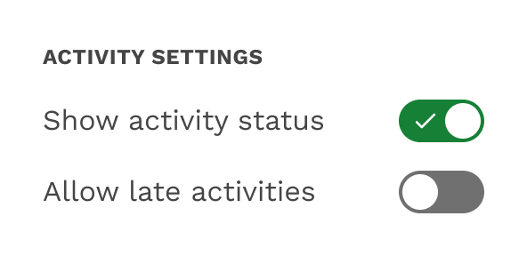
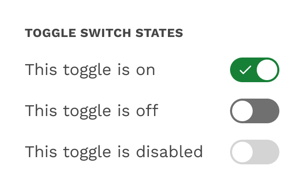

import './design-guidelines-styles.css';
import { LeadParagraph } from '../../components/LeadParagraph';

<PageContent componentName="toggle" type="design">

<LeadParagraph>Toggle Switches allow the user to select options.</LeadParagraph>

## Usage

Use toggle switches to toggle the state of a single setting on or off. You may use toggle switches within a web application, but keep in mind that they are most common within mobile applications.

<figure>
  

    
  

  <figcaption>
    
Toggle switches

  </figcaption>
</figure>

## States

The state of a toggle switch is changed by tapping or clicking on it, and the handle slides over to the other side of the track.

## Text Label

The setting that the switch controls is made clear by the inline text label.

<figure>
  

    
  

  <figcaption>
    
Toggle switch states

  </figcaption>
</figure>

</PageContent>
