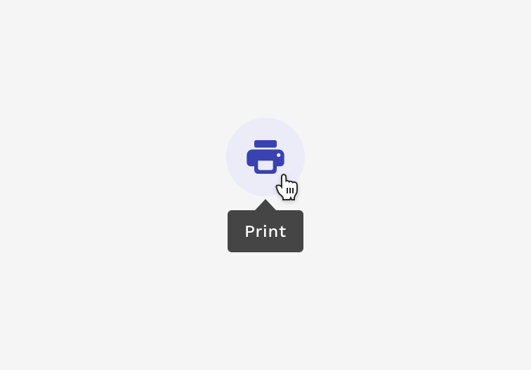
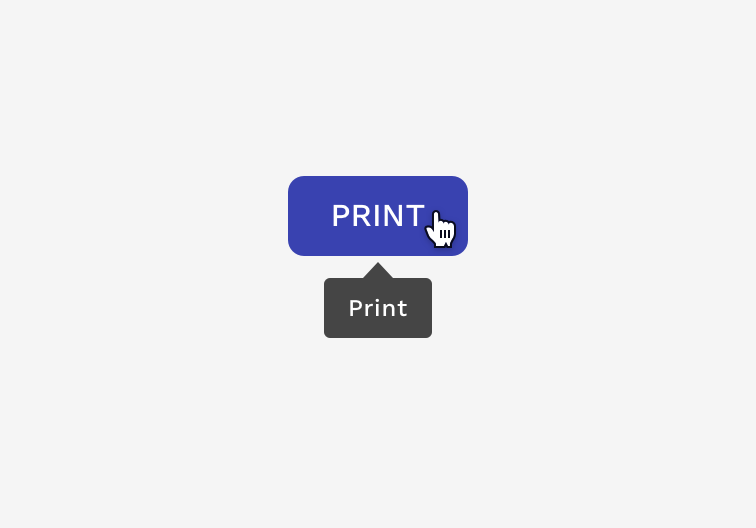
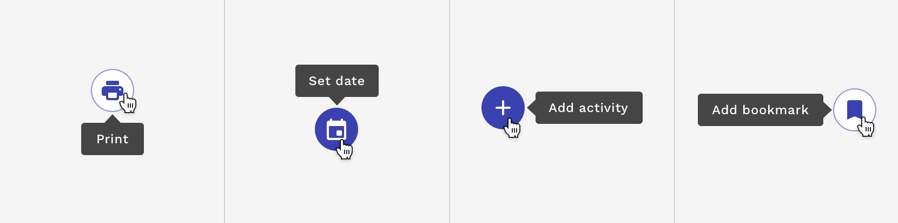

import { Link } from 'gatsby';
import './design-guidelines-styles.css';
import { DocsHeading } from '../../components/DocsHeading';
import { LeadParagraph } from '../../components/LeadParagraph';
import { Tooltip } from 'react-magma-dom';

<DocsHeading to="/api/tooltip/" type="design">
  Tooltip
</DocsHeading>
<LeadParagraph>
  Tooltips display informative text when users hover over, or focus on an
  element.
</LeadParagraph>

## Usage

Tooltips are necessary for interactive elements whose function may not be clearly spelled out within the element itself. This is especially valuable for elements that are represented only by an image or icon. Tooltips should always be paired closely with the element with which they are associated. The message within the tooltip should always be kept as short and clear as possible.

  

    

      <figure>
        
        <figcaption>
          
Correct

          
Use tooltips for interactive imagery like icon buttons.

        </figcaption>
      </figure>
    

    

      <figure>
        
        <figcaption>
          
Incorrect

          
Don’t use tooltips to restate visible UI text.

        </figcaption>
      </figure>
    

  

---

## Placement

Tooltips can be positioned below, above, to the right of, or to the left of the element they are associated with. The tooltip will automatically adjust its position to ensure it stays within the visible area of your browser window.

---

## Accessibility

Tooltips are displayed when hovering over or focusing on an element, but they are also announced to screen readers for the visually impaired. Users navigating the page with a keyboard will see the tooltip when they move focus to the element, and may dismiss the tooltip by pressing the `Escape` key.
