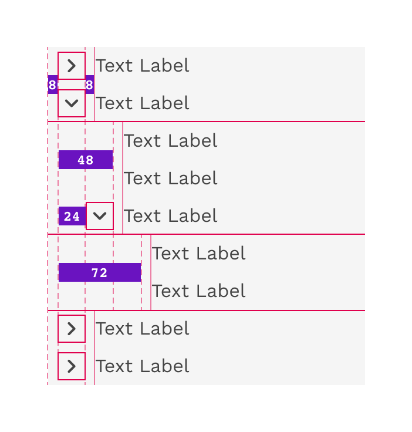
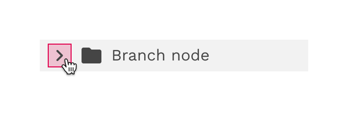

import './design-guidelines-styles.css';

<PageContent componentName="treeview" type="design">

<LeadParagraph>
  TreeView provides a hierarchical list of items that can be collapsed or
  expanded to hide or reveal their contents.
</LeadParagraph>

## Usage

A tree view comprises nested heading levels, establishing a content hierarchy for users and aiding in the navigation of extensive amounts of information. The tree view component includes branch nodes that can be expanded or collapsed, unveiling or concealing child nodes. Additionally, the tree may feature leaf nodes, which can emerge at any level of the hierarchy and do not possess child nodes.

<figure>
  

    
  

</figure>

### When to use

- Commonly utilized for exploring file system configurations consisting of folders and documents.
- To organize large amounts of information that can nest within multiple levels.

### When not to use

When dealing with a single level of nested information, consider utilizing an alternative component such as an accordion for expandable views that extend one level deep.

---

## Formatting

### Anatomy

<figure />

  

    

      <figure>
        
      </figure>
    

    

  

1. **Branch node:** A node that has one or more child nodes. Can be expanded or collapsed to reveal or hide child nodes.
1. **Leaf node:** A node that has no child nodes and can appear at any level of the tree view hierarchy. A leaf node may be referred to as a child node when it is nested underneath a branch node.
1. **Arrow icon:** An icon to expand or collapse a branch node.
1. **Checkbox (multi-select only):** A checkbox to select multiple nodes.
1. **Node icon (optional):** An icon to visually represent and support a node label, they can assist the user to scan different content types quickly.

### Alignment

#### Stacking nodes

Nodes stack directly on top of each other with 0px space between them. Having nodes flush with each other ensures consistent spacing and alignment between each node in the tree view.

  

    

      <figure>
        
      </figure>
    

    

  

#### Nesting nodes

Nested nodes in a tree view rely on organized and consistent alignment to group nodes together. When a level within the hierarchy contains both branches and leaves, the spacing is adjusted to make sure the text labels at the same level are always aligned.

  

    

      <figure>
        
      </figure>
    

    

      <figure>
        
      </figure>
    

  

---

## Content

### Node labels

You may be able to label your nodes, or the labels may be generated from code. If you have control of your label names, be brief and clear about what information the node contains. This applies to both branch and leaf nodes.

### Overflow content

If the text label is longer than the space allows, the text will wrap to 2 or more lines. This makes it even more important to be as brief as possible or allow sufficient space.

### Icons

Icons can be a helpful way of scanning a list for various item types. Icons should be clear and not require a high level of interpretation to understand. To maintain proper alignment, icons should be used at all levels of a hierarchy or not at all.

  

    

      <figure>
        
        <figcaption>
          
Correct

          
Do consistently use icons for each node in a tree view.

        </figcaption>
      </figure>
    

    

      <figure>
        
        <figcaption>
          
Incorrect

          
Do not mix text-only and icon nodes in a tree view.

        </figcaption>
      </figure>
    

  

---

## Behaviors

### States

Branch nodes and leaf nodes exhibit identical styles across various states. The sole disparity in their structure lies in the presence of an arrow, which signifies the expansion or collapse of branch nodes.

  

    

      <figure>
        
      </figure>
    

    

      <figure>
        
      </figure>
    

  

### Interactions

#### Focus

Upon receiving focus, a single-select tree sets focus on its initial node.

#### Expanding and collapsing

To expand or collapse a branch node the user can click anywhere within the arrow icon bounding box.

  

    

      <figure>
        
      </figure>
    

    

  

#### Selecting

- To select a branch node the user can click anywhere on the node excluding the arrow icon bounding box.
- To select a leaf node the user can click anywhere on the node container.

  

    

      <figure>
        
      </figure>
    

    

  

#### Keyboard controls

- **Up and down arrows:** Moves focus between visible nodes in the tree.
- **Right and left arrows:** Opens and closes branch nodes.
- **Space:** Toggles the selection state of the focused node.
- **Enter:** activates a node, i.e., performs its default action. In multi-select, it toggles the selection state of the focused node. In single-select it selects the focused node.
- **Home:** Moves focus to the first node in the tree without opening or closing a node.
- **End:** Moves focus to the last node in the tree that is focusable without opening a node.

---

## Accessibility

- <a href="https://www.w3.org/TR/aria-role/roles#tree">Tree</a> (W3C
  Recommendation)
- <a href="https://www.w3.org/WAI/ARIA/apg/patterns/treeview/">
    Tree view WAI-ARIA practices
  </a>
  (W3C)

</PageContent>
